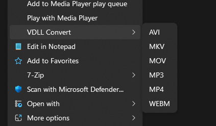

# VDLL 

### A minimal right-click video converter using FFMPEG 

why? because its convenient. most people don’t want to touch a command prompt, even if it takes two seconds.
so instead of using an ad-riddled online converter or having to spend hours re-exporting a file in your editor, just right-click your video and wait a few seconds.

## Automatic Installation

soon :tm:

## Manual installation

1. anywhere on your computer, create a file `install_vdll.ps1`
2. right-click the file, chose edit, and paste the content of [install.ps1](https://github.com/Auria-dev/vdll/blob/main/install.ps1) inside.
3. save and close the file
4. right-click it, select run with powershell, and allow admin privileges.
5. done.

## Use

- right-click a video or audio file

- pick vdll convert → choose format

- file converts in place

formats: mp4, mkv, webm, mov, avi, mp3
> on windows 11, you may need to click show more options in the context menu.
